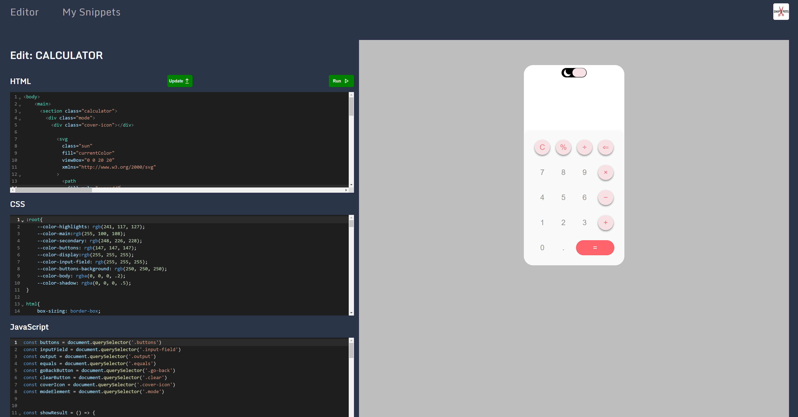
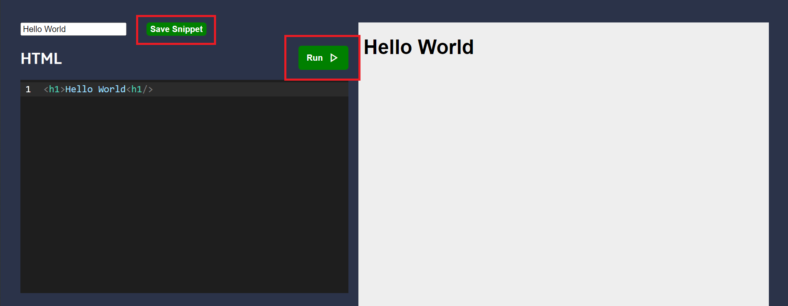
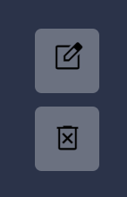

# Snippets

Snippets is a code editor that allows users to write HTML, CSS, and JavaScript code, execute it in real-time, and manage their code snippets effortlessly.

## Technologies Used

- **Frontend**: React.js
- **Backend**: Supabase

## Key Features

Within the Editor section, users can write and execute HTML, CSS, or JavaScript code. Clicking Run triggers code execution, while Save Snippet enables the saving of new code snippets or updating existing ones.

The Snippets section provides an overview of all saved code snippets, allowing users to seamlessly update or delete them as needed.

## Try It Out

Try the app [here](https://snippets-af.netlify.app/). A few snippets are already provided for testing.